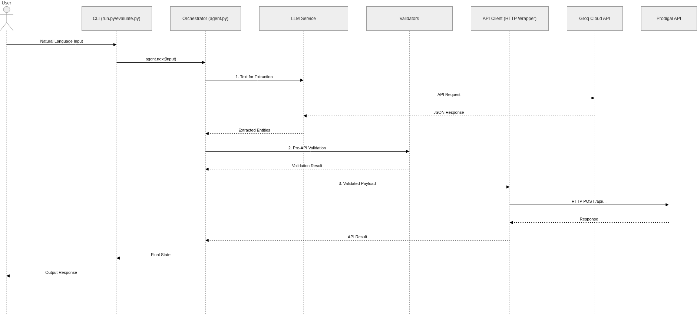

# System Design Document: Payment Collection AI Agent

## 1. Architecture Overview

- The system follows a clean 5-module separation of concerns where each component has a single responsibility. The Orchestrator (agent.py) manages conversation state and workflow progression. The LLM Service (llm_service.py) handles natural language understanding exclusively for entity extraction. Validators (validators.py) perform local data integrity checks before any external calls. The API Client (api_client.py) abstracts all communication with the mock verification server. Configuration (config.py) centralizes environment variables and constants. This modularity makes the system testable, maintainable, and allows independent evolution of each layer without tight coupling.

## 2. Key Decisions & Rationale
- The LLM is intentionally restricted to NLU/data extraction tasks only, avoiding any decision-making capabilities. This constraint prevents hallucination risks in critical financial workflows while leveraging the model's strength in understanding varied user phrasing for fields like names, dates, and identification numbers. By keeping the LLM's scope narrow, we ensure deterministic business logic remains in code where it can be thoroughly tested and audited.
- Local pre-validation (Luhn checks for card numbers, date format validation, basic range checks) occurs before any API calls to prevent unnecessary network traffic and provide immediate feedback to users. This approach reduces load on the verification service, improves user experience through faster error correction, and protects against obvious invalid data that would fail downstream anyway. It's a pragmatic efficiency gain that doesn't compromise security since the server still performs its own validation.

## 3. Tradeoffs Accepted
- We chose a rigid, deterministic state machine over a fully autonomous conversational agent because payment collection requires strict regulatory compliance and auditability. A state machine gives us explicit control over conversation flow, prevents unexpected behavior, and makes edge case handling predictable. While less flexible than an open-ended agent, this approach ensures users always progress through the required verification steps in a controlled manner, which is essential for financial transactions.
- For this assignment scope, we used in-memory state tracking instead of persistent storage like Redis or PostgreSQL since the agent is designed for single-session interactions. Adding persistence would introduce complexity unnecessary for the demo use case, where sessions are short-lived and don't require recovery across restarts. This tradeoff simplifies deployment and reduces external dependencies while still meeting the core requirements.

## 4. Future Improvements
- For production readiness, we would introduce Redis for session state to enable horizontal scaling and conversation recovery. We'd replace synchronous requests with asynchronous I/O using httpx to improve throughput under load. Comprehensive telemetry (logging, metrics, tracing) would be added to monitor performance and detect anomalies. Additional security layers like input sanitization, rate limiting, and encryption for sensitive data in transit would be implemented. Finally, we'd add unit and integration test coverage for all edge cases, particularly around validation boundaries and error handling paths.